# MegaBonk Overlay -- Complete Documentation -- Полная документация

---

# !! ATTENTION !! PROJECT HAS BEEN INTEGRATED INTO THE GAME AND IS NOW OFFICIALLY MAINTAINED BY THE DEVELOPERS! THIS REPOSITORY IS ARCHIVED AND NO LONGER MAINTAINED. FOR THE OFFICIAL VERSION OF THE OVERLAY, PLEASE REFER TO THE GAME'S BUILT-IN OVERLAY FEATURE !!

## Project was approved by Megaladder administration. This repository is an **unofficial** project developed independently by a community member and is not affiliated with or endorsed by the game's developers and/or the Megaladder development team.

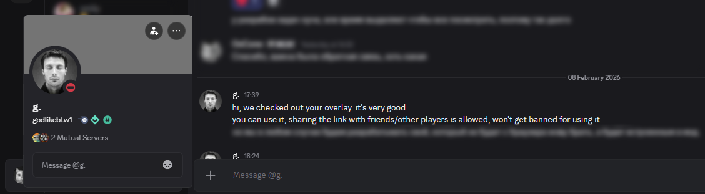

## 0. Table of Contents (EN)

| English Table of Contents | Russian Table of Contents |
|---------------------------|---------------------------|
| 0. [Table of Contents (EN)](#0-table-of-contents-en) <br> 1. [Navigation](#1-navigation)<br>2. [Project Overview](#2-project-overview)<br>3. [Installation and Configuration](#3-installation-and-configuration)<br>4. [Component Reference (Elements)](#4-component-reference)<br>5. [Development Setup](#5-development-setup)<br>6. [System Architecture](#6-system-architecture)<br>7. [Known Bugs](#7-known-bugs)<br>8. [Personal Notes](#8-personal-notes)<br>9. [Future Expansion](#9-future-expansion)<br> 10. [Art and Credits](#10-art-and-credits)<br> 11. [Disclaimer](#11-disclaimer) | 0. [Содержание (RU)](#0-содержание-ru) <br> 1. [Навигация](#1-навигация)<br>2. [Обзор проекта](#2-обзор-проекта)<br>3. [Установка и настройка](#3-установка-и-настройка)<br>4. [Справочник компонентов (элементы)](#4-справочник-компонентов)<br>5. [Настройка среды разработки](#5-настройка-среды-разработки)<br>6. [Архитектура системы](#6-архитектура-системы)<br>7. [Известные ошибки](#7-известные-ошибки)<br>8. [Заметки автора](#8-заметки-автора)<br>9. [Планы развития](#9-планы-развития)<br> 10. [Арты и благодарности](#10-арты-и-благодарности)<br> 11. [Дисклеймер](#11-дисклеймер) |

---

## 1. Navigation

| Section | Description | Link |
|---------|-------------|------|
| Project Overview | High-level description, features, capabilities | [Section 2](#2-project-overview) |
| Installation and Configuration | Download, install, configure, usage tips | [Section 3](#3-installation-and-configuration) |
| Component Reference | Per-element property documentation, context menus, visibility rules (This document was generated by AI) | [COMPONENT_REFERENCE_EN.md](./docs/COMPONENT_REFERENCE_EN.md) |
| Development Setup | How to clone, set up, and run from source | [Section 5](#5-development-setup) |
| System Architecture | Diagram, protocols, data flows, component communication | [Section 6](#6-system-architecture) |
| Known Bugs | Current known issues and workarounds | [Section 7](#7-known-bugs) |
| Personal Notes | Author's notes on design decisions | [Section 8](#8-personal-notes) |
| Future Expansion | Planned features and roadmap | [Section 9](#9-future-expansion) |

---

## 2. Project Overview

### What is MegaBonk Overlay?

MegaBonk Overlay is a real-time streaming overlay system built for **MegaBonk**, a competitive roguelike survival game. Specifically, it targets the game's ranked competitive mode called **Megaladder**, where two players compete head-to-head to eliminate more enemies within a time limit.

The overlay captures live game data (hero, weapons, tomes, items, stats, kills, match status, bans, and more) and displays it on an interactive, fully customizable, transparent OBS Browser Source overlay or in an always-on-top, transparent, in-game window.

P.S I originally created this overlay as a tool for streamers to display information about their matches in a more convenient and visually appealing format. However, as development progressed, I realized that it could be useful not only for streamers but also for regular players. So the OBS overlay designation and related terminology actually refer more to the display mode rather than the target audience. In this application - OBS = transparent display mode.

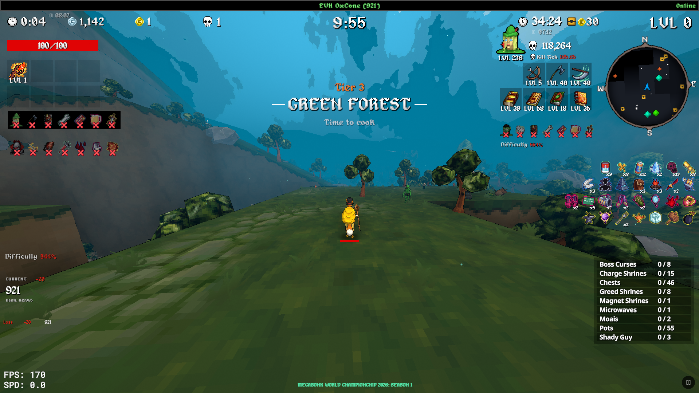
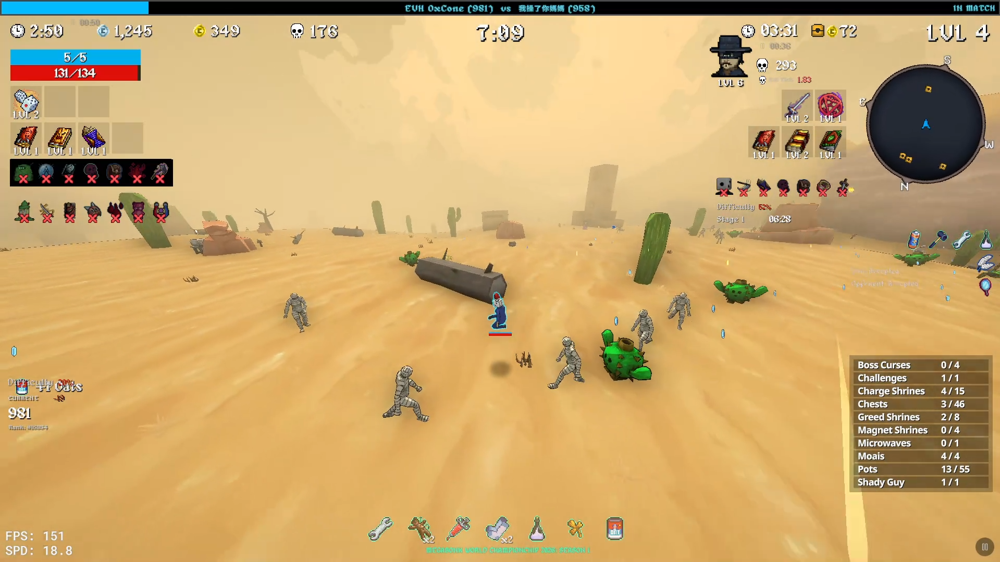
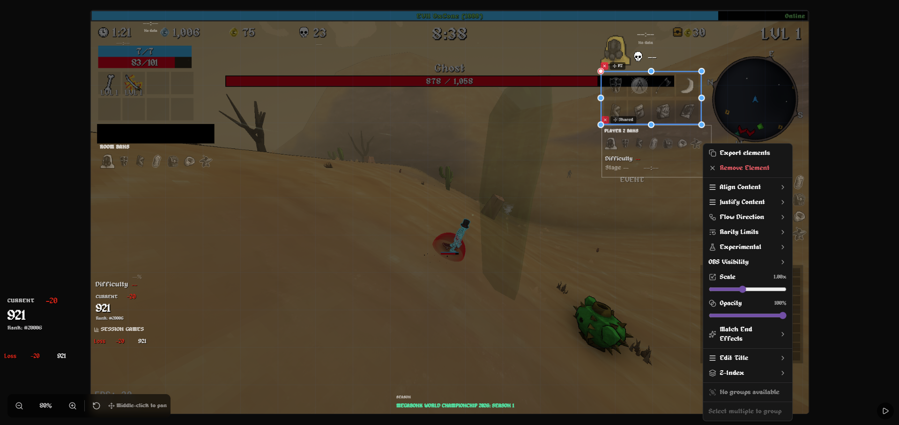

### Key Features

**Real-Time Game Data Display**
- Live tracking of hero, weapons, tomes, items, kill counts, gold, damage dealt/taken, game timer, difficulty, and 60+ individual stats
- Both your data and your opponent's data displayed simultaneously
- Spectator mode support: correctly assigns players when you are watching someone else's match

**Fully Customizable Canvas Editor**
- Drag-and-drop placement of 80+ element types onto a resolution-aware canvas (720p, 1080p, 1440p, 4K, or custom)
- Resize, scale (0.25x-2x), adjust opacity, and set Z-index per element
- Group elements together for synchronized movement
- Multi-select with Ctrl+Click or rectangle selection
- Grid snapping with configurable grid size
- Undo/Redo history (configurable 5-20 steps)
- Canvas zoom (scroll wheel) and pan (middle-click drag)

**Per-Element Context Menu Customization**
- Align content (left/center/right), justify content (start/center/end/space-between/space-around)
- Flow direction (row/column) for multi-item elements
- Item ordering (by rarity or by acquisition order)
- Toggle individual stat fields on/off for grouped stat elements
- Set rarity-based item limits per element
- Horizontal and vertical gap adjustment (0-20px)
- OBS visibility: always visible, during your run only, off in OBS, or per-phase visibility (idle, searching, acceptance, ban phase, game, match end)
- Match End Effects: per-element blur, desaturation, dimming with configurable amounts
- Custom titles and labels with show/hide toggle
- Scale and opacity sliders
- Z-index ordering (front/back/forward/backward)
- Group/ungroup operations
- Export selected elements to clipboard as shareable string

**Match Phase Awareness**
- Elements can be configured to appear only during specific match phases
- Automatic detection of matchmaking queue, ban selection, game phase, and match end
- Match end visual effects: blur, desaturate, dim with configurable per-element settings
- Victory/Defeat/Draw/Death overlay labels on match end

**Layout System**
- Export/import full layouts as compressed, encoded strings (lz-string compression with `MB1:` prefix)
- Export individual elements or groups for sharing
- Save multiple layout presets locally
- Settings sync via relay server (upload/download modes)
- Background image support for alignment reference

**Internationalization**
- Full English and Russian language support for all UI strings, element labels, stat names, and game data translations
- Language auto-detection from game API translations

**OBS Integration**
- OBS Overlay Mode: transparent background, all editor UI hidden, interaction blocker to prevent accidental clicks
- Toggle with button in bottom-right corner (Play/Pause icon)
- Designed for OBS Browser Source at specified resolution
- Works with the Tray App's in-game overlay window as well

**Matchmaking and Season Support**
- Queue status tracking (searching, match found, acceptance)
- Ban phase display with animated hero/weapon previews
- Season info display (name, time limit, pause limit, dates)
- System and player ban display organized by entity type and rarity

**Session Tracking**
- Tracks rating changes across a play session (start vs current)
- Win/loss history with game-by-game rating delta display
- Rank progression visualization

**Smart Interactions (Experimental)**
- Animated notifications for stat changes, item pickups, weapon/tome level-ups
- Diffing between game state snapshots to detect and display changes in real time

**Stage Tracking**
- Per-stage timer with countdown/count-up support
- Event labels: Boss Spawn, Final Swarm, stage transitions
- Stage history showing last 4 stages with kills, difficulty, exit times

**Fake Data / Spoof Mode**
- Full match state simulation for testing and preview without a live game
- Randomized hero, weapons, tomes, items, stats per player
- Configurable match state: idle, searching, ban phase, in-game, match ended
- Adjustable fake diff values (time, difficulty, kills)

### Technology Stack

| Component | Technology |
|-----------|-----------|
| Overlay (Frontend) | React 19, Vite (rolldown-vite), Zustand, Tailwind CSS v4, Radix UI, react-moveable, @dnd-kit, motion |
| Relay Server | Node.js, Express 5, ws (WebSocket), pkg (compiled to .exe) |
| Chrome Extension | Manifest V3, Service Worker, Content Script, Page Script (MAIN world) |
| Tray Application | Electron 40, electron-updater, electron-builder, NSIS installer |
| Layout Compression | lz-string |
| Fonts | Alagard (pixel art style) |

---

## 3. Installation and Configuration

### Download

The latest release is available from the GitHub Releases page:

**https://github.com/OxCone1/Megabonk-Overlay/releases**

Download the `MegaBonkOverlay.exe` installer.

### Installation Steps

1. **Run the installer** (`MegaBonkOverlay.exe`). This is an NSIS-based installer that will:
   - Install the MegaBonk Tray application
   - Bundle the Relay Server executable (`MegaBonkRelay.exe`)
   - Bundle the pre-built overlay static files
   - Optionally create a startup shortcut

2. **Launch MegaBonk Overlay** from the Start Menu or desktop shortcut. The tray icon will appear in the system tray.

3. **Install the Chrome Extension** manually:
   - The Chrome extension is not published on the Chrome Web Store; it must be loaded manually.
   - Open Chrome and navigate to `chrome://extensions/`
   - Enable "Developer mode" (toggle in top-right)
   - Click "Load unpacked" and select the `extension/` folder from the project repository
   - The "MegaBonk WS Bridge" extension will appear in your extensions list
   - Make sure it is enabled and has access to `https://ladder.megabonk.su/*`

4. **Open the Megaladder website** at `https://ladder.megabonk.su/` in Chrome. The extension will begin intercepting game data automatically.

5. **Configure OBS Browser Source** (for OBS usage):
   - In OBS, add a new "Browser" source
   - Set the URL to `http://127.0.0.1:17502/overlay/`
   - Set the resolution to match your canvas (e.g., 1920x1080)
   - Check "Shutdown source when not visible" (optional)
   - Check "Refresh browser when scene becomes active" (optional)

### Tray Application

The tray application provides a system tray icon with a comprehensive context menu:

**Server Management**
- Start / Stop / Reboot the relay server
- View server status (running/stopped, port number)
- Toggle log output visibility

**Session Tracking**
- Start/Stop session tracking for rating change monitoring
- View current session status

**Overlay Management**
- Start/Stop overlay serving (HTTP static file hosting)
- Show/Hide the in-game overlay window
- Toggle click-through mode for the in-game overlay (so you can interact with the game through it)

**Global Hotkeys**
- `Ctrl+Shift+O` -- Toggle the in-game overlay window visibility
- `Ctrl+Shift+I` -- Toggle click-through mode for the in-game overlay
- Hotkeys are configurable via the tray menu (Overlay submenu > Configure Hotkeys)

**Auto-Update**
- Toggle automatic update checks
- Manually check for updates
- "Restart to Install Update" when an update is downloaded

### First-Time Configuration

1. **Start the relay server** from the tray menu if it is not already running. The status indicator should show "Running" (green).

2. **Open the overlay** -- either in OBS as a Browser Source or by navigating to `http://127.0.0.1:17502/overlay/` in your browser.

3. **The sidebar** appears when you hover your mouse on the left edge of the screen. It contains three tabs:
   - **P1 (Player 1)** -- Elements for your own data
   - **P2 (Player 2)** -- Elements for your opponent's data
   - **Settings** -- Global overlay settings

4. **Add elements** by dragging them from the sidebar palette onto the canvas, or by clicking the `+` button next to an element name.

5. **Position and resize elements** by clicking to select, then dragging to move or using the corner/edge handles to resize.

6. **Right-click any element** to access the context menu with alignment, visibility, scale, opacity, match end effects, titles, labels, grouping, Z-ordering, and export options.

### Alignment Tip: Using a Reference Image

For precise overlay alignment with your game or OBS scene, it is recommended to:

1. Take a screenshot of your game running in OBS (or a screenshot of the OBS output window).
2. In the overlay Settings tab, use the "Background Image" option to paste the URL or load the image.
3. The screenshot appears behind all overlay elements, letting you position elements exactly where you want them relative to the game view.
4. Once satisfied, remove the background image. The overlay will have a transparent background in OBS mode.

### OBS Overlay Mode

Click the Play/Pause button in the bottom-right corner of the overlay to toggle OBS Overlay Mode:

- **On (Pause icon)**: Transparent background, all editor UI hidden, interaction blocker active. This is the mode that should be active when streaming.
- **Off (Play icon)**: Editor mode with dark background, sidebar access, full element editing capabilities.

When OBS Overlay Mode is activated, the canvas zoom and pan reset to default, and the sidebar is hidden.

### Settings Overview

| Setting | Description |
|---------|-------------|
| Resolution | Canvas resolution preset (720p, 1080p, 1440p, 4K, custom) |
| Language | English or Russian |
| Grid / Snapping | Toggle grid visibility and snap-to-grid behavior; configurable grid size |
| Icon Scale | Global icon size multiplier |
| Icon Source | "Local" (bundled icons) or "CDN" (game server icons) |
| Timer Direction | "Elapsed" (count up) or "Remaining" (countdown to season time limit) |
| Stat Format | "Round" (integer display) or "Decimal" (two decimal places) |
| Spectator Mode | Auto-detect spectator status or manual toggle |
| Undo/Redo Steps | Number of history steps (5-20) |
| Layout Sync | Off, Upload (save to relay), or Download (load from relay) |
| Background Image | URL to a reference image rendered behind overlay elements |
| Sidebar Auto-Hide | Automatically hide sidebar after period of inactivity |
| Clipping Warnings | Show warning icon when element content overflows its container |
| Element Outlines | Show borders around icon backgrounds |
| Hide Element Titles | Globally hide overlay element titles |
| OBS Hide Labels | Hide stat labels in OBS overlay mode |
| Global Blur on Match End | Apply blur/desaturate/dim to all elements when a match ends |
| Per-Player End Blur | Enable/disable end blur per player slot |
| Session Games Limit | Maximum games shown in session history (default: 10) |

### Advanced Settings

Enable "Advanced Settings" in the Settings tab to access:

- **Fake Data / Spoof Mode**: Simulate match data without a live game for layout testing
- **Smart Interactions**: Animated change notifications (experimental)
- **Layout Slots**: Save up to multiple layout presets, switch between them
- **Layout Export/Import**: Copy full layout as encoded string, share with others
- **Elements Export**: Copy selected elements as string, import into another layout

---

## 4. Component Reference

The full component reference documenting all 80+ overlay element types, their properties, data sources, context menu options, and visibility behavior is located in a separate file:

**[COMPONENT_REFERENCE_EN.md](COMPONENT_REFERENCE_EN.md)**

---

## 5. Development Setup

### Prerequisites

- **Node.js** 18 or later
- **npm** (bundled with Node.js)
- **Git**
- **Google Chrome** (for the extension)
- **OBS Studio** (optional, for testing the overlay as a Browser Source)

### Clone the Repository

```
git clone https://github.com/OxCone1/Megabonk-Overlay.git
cd Megabonk-Overlay
```

### Relay Server (Development)

```
cd relay-server
npm install
npm run dev
```

This starts the relay server on port 17502 with `nodemon` for auto-restart on file changes.

The server will:
- Listen for WebSocket connections on `ws://127.0.0.1:17502/ws`
- Serve HTTP REST API on `http://127.0.0.1:17502/`
- Store settings in `%LOCALAPPDATA%/MegaBonkRelay/relay-settings.json`
- Write logs to `relay-server/relay-server.log`

### Overlay (Development)

```
cd obs-megabonk-overlay
npm install
npm run dev
```

This starts the Vite dev server (typically on `http://localhost:5173/overlay/`). The overlay connects to the relay server at `ws://127.0.0.1:17502/ws`.

### Chrome Extension (Development)

1. Navigate to `chrome://extensions/` in Chrome
2. Enable "Developer mode"
3. Click "Load unpacked" and select the `extension/` folder
4. Navigate to `https://ladder.megabonk.su/`

The extension will connect to `ws://localhost:17502/ws` and begin relaying intercepted data.

### Build for Production

The `relay-server/build.ps1` PowerShell script orchestrates the entire build:

```powershell
cd relay-server
.\build.ps1
```

This will:
1. Install relay server dependencies
2. Build the relay server into a standalone `.exe` using `pkg` (targeting Node.js 18, Windows x64, with GZip compression)
3. Copy install/uninstall scripts to `dist/`
4. Build the overlay frontend (`npm run build` in `obs-megabonk-overlay/`)
5. Package the Electron tray app with `electron-builder` (NSIS installer for Windows)

Output: `relay-server/dist/MegaBonkOverlay.exe` (NSIS installer)

### Tray App (Development)

```
cd relay-server/tray
npm install
npm start
```

This launches the Electron tray app in development mode. It will attempt to find and start the relay server executable automatically.

### Project Structure

```
Megabonk-OBS/
  extension/                  Chrome Extension (Manifest V3)
    manifest.json             Extension configuration
    background.js             Service worker -- WebSocket relay to server
    content.js                Content script -- bridge between page and service worker
    inject.js                 Page script (MAIN world) -- intercepts WebSocket/Fetch
  relay-server/               Relay Server (Node.js)
    relay-server.js           Main server: HTTP API + WebSocket relay
    package.json              Dependencies (express, ws, nodemon, pkg)
    build.ps1                 Full build pipeline script
    install.ps1               Installer launcher script
    uninstall.ps1             Comprehensive uninstaller
    start-hidden.vbs          VBScript to launch server without console window
    lib/
      logger.js               File-based logging
      roomCache.js            LRU room data cache (max 10 rooms)
      sessionTracking.js      Persistent session rating tracking
      settings.js             Per-user settings persistence
    tray/                     Electron Tray Application
      main.js                 Tray app: server lifecycle, overlay window, hotkeys, auto-update
      package.json            Electron dependencies + electron-builder config
  obs-megabonk-overlay/       OBS Overlay (React SPA)
    vite.config.js            Vite config (base: /overlay/)
    package.json              Frontend dependencies
    src/
      App.jsx                 Root component
      main.jsx                Entry point
      index.css               Tailwind CSS + theme + custom fonts
      stores/
        overlayStore.js       Zustand store -- all overlay UI state, elements, player data
        gameDataStore.js      Zustand store -- game entity data (heroes, weapons, tomes, items)
        smartInteractionsStore.js  Smart interaction event tracking
      components/
        elements/             80+ overlay element components (see Component Reference)
        overlay/              Canvas infrastructure (drag, resize, grid, selection, rendering)
        sidebar/              Sidebar UI (element palette, settings panel)
        ui/                   shadcn/ui component library
      hooks/
        useRelayServer.jsx    Re-export shim
        useRelayServerWorker.jsx  Core hook: Web Worker bridge, player slot assignment, spectator detection
        useRelaySettings.jsx  Bidirectional settings sync with relay server
      workers/
        networkWorker.js      Dedicated Web Worker for WebSocket + HTTP communication
      lib/
        i18n.js               English/Russian internationalization (300+ keys per language)
        layoutShare.js        Layout serialization/compression (lz-string, v2 compact format)
        stageTracking.js      Stage progression tracking with timing data
        publicAsset.js        Vite BASE_URL-aware asset path resolution
        utils.js              cn() class merger, throttle, debounce utilities
    public/
      Game Icons/             Local game icons (Heroes/, Weapons/, Tomes/, Items/, Interface/)
    image_map.json            Offline icon path mapping
    level_timings.json        Per-level stage event timing data
  docs/                       Documentation
  scripts/                    Development utility scripts
```

---

## 6. System Architecture

### Architecture Diagram

```
+-------------------------------------------------------------------+
|                        USER'S BROWSER                              |
|                                                                    |
|  +----------------------+     +------------------------------+     |
|  | ladder.megabonk.su   |     | Chrome Extension             |     |
|  | (Game Website)       |     | MegaBonk WS Bridge           |     |
|  |                      |     |                              |     |
|  |  WebSocket traffic   |---->| inject.js [MAIN world]       |     |
|  |  (game sync events)  |     |   Patches WebSocket          |     |
|  |                      |     |   and Fetch APIs             |     |
|  |  HTTP API responses  |---->|                              |     |
|  |  (/api/heroes, etc.) |     | content.js [Content Script]  |     |
|  +----------------------+     |   Bridges page <-> extension |     |
|                               |                              |     |
|                               |background.js [Service Worker]|     |
|                               |   Persistent WS connection   |     |
|                               |   to Relay Server            |     |
|                               +-------------|----------------+     |
+-------------------------------|-------------|--------------------- +
                                |             |
                   WebSocket    |             | WebSocket
                   (port 17502) |             | (send intercepted
                                |             |  API_RESPONSE,
                                |             |  WS_EVENT messages)
                                v             v
+-------------------------------------------------------------------+
|                       RELAY SERVER                                 |
|                    (Node.js / Express / ws)                        |
|                       Port 17502                                   |
|                                                                    |
|  +---------------------------+  +------------------------------+   |
|  | In-Memory Game Context    |  | HTTP REST API                |   |
|  |                           |  |   /health                    |   |
|  | - Heroes Map              |  |   /api/context               |   |
|  | - Weapons Map             |  |   /api/entities              |   |
|  | - Tomes Map               |  |   /api/room, /api/room/:id   |   |
|  | - Items Map               |  |   /api/season, /api/seasons  |   |
|  | - Active Season + Bans    |  |   /api/profile               |   |
|  | - Profile                 |  |   /api/friends               |   |
|  | - Players Map             |  |   /api/translations          |   |
|  | - Room Meta + Bans        |  |   /api/settings (GET/POST)   |   |
|  | - Queue State             |  |   /api/session               |   |
|  | - Friends                 |  |   /overlay/* (static files)  |   |
|  | - Translations            |  +------------------------------+   |
|  +---------------------------+                                     |
|                                                                    |
|  +---------------------------+  +------------------------------+   |
|  | WebSocket Server          |  | Room Cache (LRU, max 10)     |   |
|  |   /ws                     |  |   Last 10 room states        |   |
|  |   Client tracking         |  |   Room bans cache            |   |
|  |   Broadcast to SPA/EXT    |  +------------------------------+   |
|  +---------------------------+                                     |
|                                                                    |
|  +---------------------------+  +------------------------------+   |
|  | Session Tracking          |  | Settings Store               |   |
|  |   Rating deltas           |  |   Per-user layouts           |   |
|  |   Win/Loss history        |  |   Persisted to disk          |   |
|  |   Persistent to disk      |  +------------------------------+   |
|  +---------------------------+                                     |
+------------------------------|------------------------------------+
                                |
                                | WebSocket + HTTP
                                |
            +-------------------|-------------------+
            |                   v                   |
            |  +--------------------------------+   |
            |  | networkWorker.js (Web Worker)   |  |
            |  |   WebSocket client              |  |
            |  |   HTTP fetch (entities, room,   |  |
            |  |     profile, season, session)   |  |
            |  |   Heartbeat (30s interval)      |  |
            |  |   Auto-reconnect (exp backoff)  |  |
            |  |   Data transformation           |  |
            |  +-------------|------------------+   |
            |                | postMessage          |
            |                v                      |
            |  +--------------------------------+   |
            |  | useRelayServerWorker.jsx (Hook) |  |
            |  |   Player slot assignment        |  |
            |  |   Spectator detection           |  |
            |  |   Ban normalization             |  |
            |  |   Room change grace period      |  |
            |  |   Match end handling            |  |
            |  |   Update throttling (drag)      |  |
            |  +-------------|------------------+   |
            |                |Zustand store updates |
            |                v                      |
            |  +--------------------------------+   |
            |  | overlayStore.js (State)         |  |
            |  | gameDataStore.js (Entities)     |  |
            |  |                                 |  |
            |  | React Components render from    |  |
            |  | store state                     |  |
            |  +--------------------------------+   |
            |                                       |
            |  OBS Overlay / In-Game Overlay Window |
            +---------------------------------------+

+-------------------------------------------------------------------+
|                     TRAY APPLICATION                              |
|                    (Electron Process)                             |
|                                                                   |
|  - Manages Relay Server lifecycle (start/stop/reboot)             |
|  - Provides system tray icon with context menu                    |
|  - Hosts transparent, always-on-top overlay BrowserWindow         |
|  - Global keyboard shortcuts (Ctrl+Shift+O, Ctrl+Shift+I)         |
|  - Auto-updater via GitHub Releases                               |
|  - Health polling every 5 seconds                                 |
|  - Config persistence (server path, hotkeys, preferences)         |
+-------------------------------------------------------------------+
```

### Communication Protocols and Data Types

| Path | Protocol | Data Type |
|------|----------|-----------|
| Game Website --> Chrome Extension | In-page interception (patched WebSocket + Fetch) | Raw game WebSocket frames (JSON), HTTP API responses (JSON) |
| Chrome Extension (inject.js --> content.js) | `window.postMessage` | Serialized event objects (`WS_BRIDGE` type) |
| Chrome Extension (content.js --> background.js) | `chrome.runtime.sendMessage` | Event objects with nested JSON strings |
| Chrome Extension (background.js --> Relay Server) | WebSocket (`ws://127.0.0.1:17502/ws`) | JSON messages: `API_RESPONSE` (heroes, weapons, tomes, items, season, profile, room, friends, translations), `WS_EVENT` (game sync, player channel, finder channel events) |
| Relay Server --> Overlay (broadcast) | WebSocket (`ws://127.0.0.1:17502/ws`) | `context-update` (typed partial state), `player-update` (single player delta), `room-changed`, `room-data-available`, `heartbeat-ack` |
| Overlay --> Relay Server (fetch) | HTTP GET/POST (`http://127.0.0.1:17502/api/*`) | Entity data, room state, season info, user settings, session stats |
| Overlay Worker --> Main Thread | `postMessage` / `onmessage` | Transformed game data: entities, players, room meta, bans, queue state, session stats |
| Relay Server --> Tray App | HTTP polling (`/health`) | Server status, session status, overlay serving status |
| Relay Server --> Disk | File I/O | Settings JSON (`relay-settings.json`), session JSON (`relay-session.json`), logs (`relay-server.log`) |

### Data Flow Categories

| Category | Content | Source | Destination |
|----------|---------|--------|-------------|
| Entity Data | Heroes, weapons, tomes, items (ID, name, image, rarity) | Game API `/api/heroes`, `/api/weapons`, `/api/tomes`, `/api/items` | Relay `gameContext` Maps --> Overlay `gameDataStore` |
| Season Data | Active season name, time limit, pause limit, dates, maps, ban rules | Game API `/api/seasons/active` | Relay `gameContext.activeSeason` + `bans` --> Overlay `seasonInfo` |
| Profile Data | User ID, nickname, avatar, country, rating | Game API `/api/profile` | Relay `gameContext.profile` --> Overlay `currentUser_id` |
| Room Data | Room ID, lobby number, queue type, status, phase, player IDs, profiles, game status | Game API `/api/room/*` + WebSocket `room_update` events | Relay `gameContext.roomMeta` --> Overlay `roomMeta` |
| Player Run Data | Character (hero, level, stats), equipment (weapons, tomes, items with levels/counts), combat (kills, gold, damage, shrines, game stats, damage sources), map (tier, stage) | WebSocket `run_data_updated` events | Relay `gameContext.players` Map --> Overlay `player1State` / `player2State` |
| Ban Data | System-disabled entities, player-banned entities (heroes, weapons, tomes, items by rarity) | Game API room data + WebSocket `match_start` / `bans_updated` / `bans_confirmed` events | Relay `gameContext.roomBans` --> Overlay `roomBans` |
| Queue Data | Queue status, type, rating, size, elapsed time, proposal ID, acceptance state | WebSocket `finder:player:*` channel events | Relay `gameContext.queueState` --> Overlay `queueState` |
| Translation Data | Game UI strings in multiple languages | Game API `/api/i18n/translations` | Relay `gameContext.translations` --> Overlay i18n cache |
| Session Data | Start rating/rank, current rating/rank, game history with deltas | Relay server session tracking (computed from room/match events) | Relay `sessionTracking` --> Overlay `sessionStats` |
| Settings Data | Layout payload (elements, groups, resolution, icon settings), encoded as base64 | Overlay --> Relay Server HTTP POST `/api/settings` | Relay settings store --> Disk |

---

## 7. Known Bugs

- **Player slot assignment in spectator mode**: When rapidly switching between rooms as a spectator, there can be a brief period where player data appears in the wrong slot. The 350ms room change grace period mitigates this but does not eliminate it entirely.
- **Ban data race conditions**: During the ban phase, if `bans_updated` and `match_start` events arrive in quick succession, ban slots may become permanently assigned to the wrong player for the remainder of the match. This is due to the current logic for assigning ban slots based on event timing and player ID matching, which can fail in edge cases with rapid event sequences. Relay reboot and refreshing the ladder page can resolve this issue for the affected match.
- **Overlay background image persistence**: The background image URL is not persisted across layout exports/imports. It must be re-set manually after importing a layout.
- **Chrome extension reconnect**: If the relay server is restarted, the Chrome extension's service worker may take up to 30 seconds (maximum backoff) to reconnect. During this time, game data is queued (up to 1000 messages) and delivered upon reconnection.
- **CDN icon loading**: When using CDN icon source, icons may fail to load if the game server is unreachable or if the URL format changes. Local icons (bundled) are recommended for reliability.
- **Smart Interactions**: First intended as an active feature, the smart interactions system is currently in an experimental state and may produce inaccurate or missed notifications due to the complexity of diffing game state snapshots. It is disabled by default and should be enabled with caution. If someone is interested in contributing to improving this system, please reach out or submit a pull request! I have provided a special script that captures all the events happening in the game and logs them to a file, which can be used to analyze and refine the event detection logic without needing to play live games. Navigate to `scripts/ws-diff-logger.js` and run it with `node ws-diff-logger.js --player 1` (or `--player 2`) to start logging events for the specified player slot. The output will be saved to /scripts/logs/ws-diff-logs.log for analysis. Running relay server and be joined to a match is required to capture events.

---

## 8. Personal Notes

- As I mentioned in the introduction, I originally created this overlay as a tool for streamers to display their match information in a more convenient and visually appealing format. However, as I developed it, I realized that it could be useful not only for streamers but also for regular players who want to have an enhanced in-game experience with real-time data visualization.
- When the idea for the overlay first came about, I started thinking about how exactly to implement it. One option I considered was to eliminate the need for a constantly open browser tab by creating a standalone server (running locally on each user's machine) that would handle communication with the MegaLadder servers via WebSocket and API calls. However, I decided that this approach would not be very ethical towards the developers of MegaLadder, and I also suspected that it might violate some of the site's rules or guidelines. Additionally, it would significantly complicate the user experience, as users would have to log in to the site and manually extract their Steam authentication token (which also has a relatively short lifespan of around 1-3 days) every time they wanted to use the overlay. Therefore, the idea of using a Chrome extension that simply listens to the data already being sent to the site and relays it to a local server seemed like a simpler, more reliable, and more ethical solution.
- As for the implementation of the overlay itself, I wanted to make it as customizable as possible so that users could create their own layouts and save them, as well as share them with others. Initially, I planned to implement a plugin system that would allow users to create their own custom overlay element types, but I settled for basic functionality for exporting/importing individual layout elements, as this already provided enough flexibility for creating more unique overlays. Yes, the format in which layouts are saved turned out to be quite long (especially if there are many elements in the layout), and a separate service for storing/sharing layouts between users would have been more appropriate, but I decided that this would be overkill for this project, as even with such a format, sharing layouts between users still remains quite simple.

---

## 9. Future Expansion

- **Additional language support** beyond English and Russian (contributions are welcomed!)
- **Fixed and expanded smart interactions** with more event types and customizable notification styles
- **Performance overlay** showing frame timing and WebSocket message rates
- **Recording/replay** of match data for post-game analysis
- **Multiple overlay profiles** with quick-switch support
- **Historical stat tracking** with graphing capabilities across multiple sessions
<!-- - **Plugin system** for custom element types contributed by the community -->
<!-- - **Mobile companion view** for monitoring overlay status from a phone -->
<!-- - **Webhook integrations** for posting match results to Discord or other platforms -->
<!-- - **Overlay themes** with pre-configured color schemes and font selections -->
<!-- - **Multi-monitor support** for placing overlay elements across multiple displays -->
<!-- - **Compact/minimal mode** with reduced UI complexity for casual users -->
<!-- - **Layout marketplace** for sharing overlay configurations between users -->

---

## 10. Art and Credits

- **Icons**: All weapon, tome, item icons have been sourced from the [presskit](https://megabonk.itch.io/megabonk-presskit-release) provided by [Ved](https://www.youtube.com/@Vedinad). Interface and hero icons have been manually sourced from the game files and assets, and were bundled locally in the overlay for reliability. The `image_map.json` file provides a mapping of entity IDs to local icon paths.
- **Fonts**: The "Alagard" pixel art font is used for all text in the overlay. It is included in the project under `obs-megabonk-overlay/src/assets/fonts/`. For all non-English characters (e.g., Russian), the font falls back to Noto Sans.
- **App Icon**: Special thanks to [TysoBro](https://www.instagram.com/tysobro_) for allowing me to use one of their amazing arts as the app icon! The icon was created by TysoBro and is used with permission. You can check out more of their incredible artwork on their [Instagram](https://www.instagram.com/tysobro_/). Link to the original artwork used for the icon: [TysoBro Art](https://www.newgrounds.com/art/view/tysobro/megabonk-fox-2).

| Original Artwork by TysoBro | App Icon (Edited by OxCone) |
| :---: | :---: |
|  |  |

- **To MegaLadder Community**: A huge thank you to the all the people responsible for creating and maintaining the Megaladder website and API, which made this project possible. Special thanks to [SilverName](https://www.twitch.tv/silvername) for his initiative in creating such an awesome competitive platform for the MegaBonk community! Without the Megaladder, there would be no competitive scene for MegaBonk, and consequently, the game would've evetually died out after the initial wave of content creators and streamers stopped playing. The Megaladder has brought so much life and excitement to the community, and has been a constant source of inspiration for me to create this overlay project. I am incredibly grateful for the work that has gone into building and maintaining the Megaladder, and I hope that this overlay can contribute in some small way to enhancing the experience for players and viewers alike. GAAAAZ!
- **Contributors**: This project is currently developed solely by me. However, contributions from the community are highly welcomed! If you have ideas, bug fixes, or new features you'd like to see implemented, please feel free to submit a pull request or open an issue on the GitHub repository.

---

## 11. Disclaimer

- **Unofficial Project**: This overlay is an unofficial, fan-made project and is not affiliated with or endorsed by the developers of MegaBonk or the Megaladder. It is intended for personal use and community enhancement only.
- **Use at Your Own Risk**: While I have made every effort to ensure the stability and security of this overlay, it is provided "as is" without any warranties. Use it at your own risk, and always be cautious when downloading and running executables from the internet.
- **Privacy**: The overlay and relay server run locally on your machine and do not transmit any personal data to external servers. The Chrome extension only intercepts data from the Megaladder website and relays it to the local server. No data is stored or shared externally by this project.
- **Support**: As this is a free, open-source project developed in my spare time, I may not be able to provide immediate support for issues or feature requests. However, I will do my best to address bugs and consider new features as time allows. Please be patient and feel free to contribute if you have the skills and interest!
- **Legal**: All game data is obtained through the official Megaladder API and WebSocket events. The overlay does not modify or interact with the game client directly, and only displays data that is publicly available through the Megaladder. However, users should be aware of the terms of service of the Megaladder and ensure that using an overlay like this does not violate any rules or guidelines set by the platform.
- **Use of AI**: Some parts of the codebase and documentation have been devepoped with the assistance of AI tools. While I have reviewed and tested all code that has been written with AI assistance, there may be edge cases or bugs that I am not aware of. If you encounter any issues, please report them so I can investigate and fix them.

---

*Last Updated: February 2026*
*Repository: https://github.com/OxCone1/Megabonk-Overlay*

---

# !! ВНИМАНИЕ !! ПРОЕКТ БЫЛ ИНТЕГРИРОВАН В ИГРУ И ТЕПЕРЬ ОФИЦИАЛЬНО ПОДДЕРЖИВАЕТСЯ РАЗРАБОТЧИКАМИ! ДАННЫЙ РЕПОЗИТОРИЙ АРХИВИРОВАН И БОЛЬШЕ НЕ ПОДДЕРЖИВАЕТСЯ. ДЛЯ ОФИЦИАЛЬНОЙ ВЕРСИИ ОВЕРЛЕЯ, ПОЖАЛУЙСТА, ИЗУЧИТЕ ВСТРОЕННУЮ ФУНКЦИЮ ОВЕРЛЕЯ В ИГРЕ !!


## Проект был одобрен администрацией Megaladder. Этот репозиторий является **неофициальным** проектом, разработанным независимо одним из участников сообщества и не связан с разработчиками игры и/или модификации Megaladder

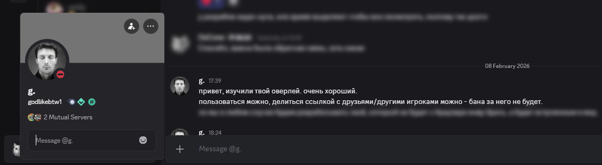

## 0. Содержание (RU)

| English Table of Contents | Russian Table of Contents |
|---------------------------|---------------------------|
|0. [Table of Contents (EN)](#0-table-of-contents-en) <br>1. [Navigation](#1-navigation)<br>2. [Project Overview](#2-project-overview)<br>3. [Installation and Configuration](#3-installation-and-configuration)<br>4. [Component Reference (Elements)](#4-component-reference)<br>5. [Development Setup](#5-development-setup)<br>6. [System Architecture](#6-system-architecture)<br>7. [Known Bugs](#7-known-bugs)<br>8. [Personal Notes](#8-personal-notes)<br>9. [Future Expansion](#9-future-expansion)<br> 10. [Art and Credits](#10-art-and-credits)<br> 11. [Disclaimer](#11-disclaimer) | 0. [Содержание (RU)](#0-содержание-ru) <br>1. [Навигация](#1-навигация)<br>2. [Обзор проекта](#2-обзор-проекта)<br>3. [Установка и настройка](#3-установка-и-настройка)<br>4. [Справочник компонентов (элементы)](#4-справочник-компонентов)<br>5. [Настройка среды разработки](#5-настройка-среды-разработки)<br>6. [Архитектура системы](#6-архитектура-системы)<br>7. [Известные ошибки](#7-известные-ошибки)<br>8. [Заметки автора](#8-заметки-автора)<br>9. [Планы развития](#9-планы-развития)

---

## 1. Навигация

| Раздел | Описание | Ссылка |
|--------|----------|--------|
| Обзор проекта | Общее описание, возможности, функции | [Раздел 2](#2-обзор-проекта) |
| Установка и настройка | Загрузка, установка, настройка, советы по использованию | [Раздел 3](#3-установка-и-настройка) |
| Справочник компонентов | Документация свойств каждого элемента, контекстные меню, правила видимости (данный документ был сгенерирован ИИ) | [COMPONENT_REFERENCE_RU.md](COMPONENT_REFERENCE_RU.md) |
| Настройка среды разработки | Как клонировать, настроить и запустить из исходного кода | [Раздел 5](#5-настройка-среды-разработки) |
| Архитектура системы | Диаграмма, протоколы, потоки данных, взаимодействие компонентов | [Раздел 6](#6-архитектура-системы) |
| Известные ошибки | Текущие известные проблемы и обходные пути | [Раздел 7](#7-известные-ошибки) |
| Заметки автора | Заметки автора о решениях проектирования | [Раздел 8](#8-заметки-автора) |
| Планы развития | Планируемые функции и дорожная карта | [Раздел 9](#9-планы-развития) |

---

## 2. Обзор проекта

### Что такое MegaBonk Overlay?

MegaBonk Overlay - это интерактивный и полностью настраиваемый оверлей реального времени, созданный для игры **MegaBonk**. Оверлей ориентирован на ранговый соревновательный мод игры - **Megaladder**, где два игрока соревнуются в уничтожении наибольшего количества врагов за ограниченное время.

Оверлей предоставляет игровые данные в реальном времени (герои, оружия, тома, предметы, характеристики, убийства, статус матча, баны и многое другое) и отображает их на интерактивном, полностью настраиваемом прозрачном окне поверх игры или имеет возможность использования как OBS Browser Source.

P.S Изначально я создавал этот оверлей как инструмент для стримеров, чтобы они могли отображать информацию о своих матчах в более удобном и визуально привлекательном формате. Однако, по мере разработки, я понял, что он может быть полезен не только для стримеров, но и для обычных игроков. Так что обозначения OBS оверлей и терминология, связанная с ним, в действительности относится скорее к режиму отображения, а не к целевой аудитории. В данном приложении - OBS = прозрачный режим отображения.


### Основные возможности

**Отображение игровых данных в реальном времени**

- Отслеживание героя, оружия, томов, предметов, убийств, золота, нанесённого/полученного урона, игрового таймера, сложности и более 60 индивидуальных характеристик
- Одновременное отображение данных вашего персонажа и оппонента
- Поддержка режима зрителя: корректное назначение игроков при просмотре чужого матча

**Полностью настраиваемый редактор холста**

- Возможность добавления более 80 типов элементов на холст с учётом разрешения (720p, 1080p, 1440p, 4K или произвольное)
- Изменение размера, масштаба (0.25x-2x), прозрачности и Z-индекса для каждого элемента
- Группировка элементов для более простого размещения и взаимодействия
- Мульти выделение через Ctrl+Click или прямоугольное выделение
- Привязка к сетке с настраиваемым размером
- Отмена/Повтор действий (настраиваемо, 5-20 последних действий)
- Масштабирование холста (колесо мыши) и панорамирование (перетаскивание средней кнопкой)

**Контекстное меню для каждого элемента**

- Выравнивание содержимого (лево/центр/право), распределение (начало/центр/конец/space-between/space-around)
- Выбор строка/столбец для многоэлементных компонентов (предметы)
- Сортировка предметов (по редкости или по порядку получения)
- Включение/отключение отдельных полей характеристик для сгруппированных элементов
- Ограничение количества в строке/столбце предметов по уровням редкости
- Регулировка горизонтальных и вертикальных отступов (0-20px)
- Видимость в режиме оверлея: всегда видим, только во время раунда, выключен, или по фазам матча (покой, поиск, принятие, фаза банов, игра, конец матча)
- Эффекты конца матча: размытие, обесцвечивание, затемнение с настраиваемыми параметрами для каждого элемента
- Пользовательские заголовки и метки с переключением видимости
- Ползунки масштаба и прозрачности
- Управление Z-индексом (на передний план/на задний план/вперёд/назад)
- Группировка/разгруппировка
- Экспорт выбранных элементов в буфер обмена для возможности обмена с другими пользователями

**Осведомлённость о фазах матча**

- Элементы можно настроить на отображение только на время определённых фаз матча
- Автоматическое определение поиска матча, фазы банов, игровой фазы и конца матча
- Визуальные эффекты конца матча: размытие, обесцвечивание, затемнение с настраиваемыми параметрами
- Надписи Победа/Поражение/Ничья/Смерть при завершении матча

**Система макетов (Layout)**

- Экспорт/импорт полных макетов как сжатые закодированные строки (сжатие lz-string с префиксом `MB1:`)
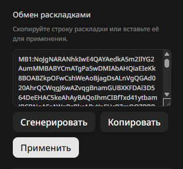
- Экспорт отдельных элементов или групп для обмена
- Сохранение нескольких пресетов макетов локально
- Возможность добавления своего изображения фона для более удобного позиционирования элементов (не сохраняется в макете, должно быть настроено отдельно)
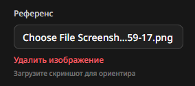
- Синхронизация настроек через relay-сервер (режимы загрузки/скачивания)

  - Если включён режим загрузки, при открытии оверлея он будет пытаться загрузить последний сохранённый макет из сервера (**ВАЖНО**: необходимо бездействие (не двигать элементы, не делать изменений) в течении 5 секунд чтобы загрузка произошла). Если включён режим сохранения, при каждом изменении макета он будет сохраняться на сервере (**ВАЖНО**: необходимо бездействие (не двигать элементы, не делать изменений) в течении 5 секунд чтобы сохранение произошло), и может быть доступен для загрузки на другом устройстве или после переустановки.

| Режим загрузки активен | Режим сохранения активен | Синхронизация отлючена |
| :---: | :---: | :---: |
| 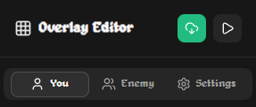 |  | 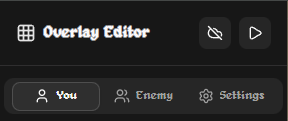 |

**Интернационализация**

- Полная поддержка английского и русского языков для всех строк интерфейса, названий элементов, имён характеристик и переводов игровых данных.

  **ВАЖНО**: для корректного отображения русских названий необходимо использовать ladder.megabonk.su на русском языке, так как язык данных определяется из API-переводов игры.

**Интеграция для прозрачности в режиме оверлея и OBS**

- Режим OBS Overlay (прозрачность): прозрачный фон, весь интерфейс редактора скрыт, блокировка взаимодействия для предотвращения случайных кликов
- Переключение кнопкой в правом нижнем углу (иконка Play/Pause)
- Режим предназначен для OBS Browser Source с указанным разрешением
- Необходим для обеспечения прозрачности при использовании в игровом оверлее

**Поддержка матчмейкинга и сезонов**

- Отслеживание статуса очереди (поиск, найден матч, принятие)
- Отображение фазы банов с анимированным превью героев/оружия
- Информация о сезоне (название, лимит времени, лимит пауз, даты)
- Системные и пользовательские баны, организованные по типам сущностей и редкости

**Отслеживание сессии**

- Отслеживание изменений рейтинга за игровую сессию (начало vs текущий)
- История побед/поражений с дельтой рейтинга по каждой игре
- Визуализация продвижения по рангу

**Умные взаимодействия (экспериментально) (багованно)**

- Анимированные уведомления об изменениях характеристик, подборе предметов, повышении уровня оружия/томов
- Сравнение данных игры для обнаружения и отображения изменений в реальном времени

**Отслеживание стадий**

- Таймер по стадиям с обратным/прямым отсчётом
- Надписи событий: появление босса, финальный рой, переходы стадий
- История стадий: последние 3 стадии с убийствами, сложностью, временем выхода

**Фейковые данные / режим спуфинга**

- Полная симуляция состояния матча для тестирования и предварительного просмотра без живой игры
- Случайный герой, оружие, тома, предметы, характеристики для каждого игрока
- Настраиваемое состояние матча: покой, поиск, фаза банов, в игре, матч завершён
- Регулируемые фейковые значения разниц (время, сложность, убийства)

### Стек технологий

| Компонент | Технология |
|-----------|-----------|
| Оверлей (фронтенд) | React 19, Vite (rolldown-vite), Zustand, Tailwind CSS v4, Radix UI, Shadcn, react-moveable, @dnd-kit, motion |
| Relay-сервер | Node.js, Express 5, ws (WebSocket), pkg (компиляция в .exe) |
| Расширение Chrome | Manifest V3, Service Worker, Content Script, Page Script (MAIN world) |
| Приложение в трее | Electron 40, electron-updater, electron-builder, NSIS-инсталлятор |
| Сжатие макетов | lz-string |
| Шрифты | Alagard (пиксельный стиль), Noto Sans (запасной для не-латинских символов) |

---

## 3. Установка и настройка

### Загрузка

Последний релиз доступен на странице GitHub Releases:

**https://github.com/OxCone1/Megabonk-Overlay/releases**

Скачайте инсталлятор `MegaBonkOverlay.exe` и архив расширения `extension.zip` (для ручной установки расширения Chrome) из последнего релиза.

### Порядок установки

1. **Запустите инсталлятор** (`MegaBonkOverlay.exe`). Это NSIS-инсталлятор, который:
   - Установит приложение MegaBonk Overlay
   - Включит исполняемый файл Relay-сервера (`MegaBonkRelay.exe`)
   - Включит предварительно собранные статические файлы оверлея

2. **Запустите MegaBonk Overlay** из меню Пуск или ярлыка на рабочем столе. Иконка трея появится в системном трее.

3. **Установите расширение Chrome** вручную:
   - Расширение Chrome не опубликовано в Chrome Web Store; его необходимо загрузить вручную.
   - Распакуйте архив `extension.zip` и сохраните папку `extension/` на вашем компьютере
   - Проверьте в какой папке находится `manifest.json` внутри распакованной папки, так как именно эту папку нужно будет загрузить в Chrome (например, `extension/` или `extension/extension/` в зависимости от структуры архива)
   - Откройте Chrome и перейдите по адресу `chrome://extensions/`
   - Включите "Режим разработчика" (переключатель в правом верхнем углу) (1)
   - Нажмите "Загрузить распакованное расширение" и выберите папку `extension/` из репозитория проекта (2)
    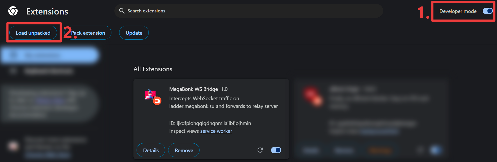
   - Расширение "MegaBonk WS Bridge" появится в списке расширений
   - Убедитесь, что оно включено и имеет доступ к `https://ladder.megabonk.su/*`

4. **Откройте сайт Megaladder** по адресу `https://ladder.megabonk.su/` в Chrome. Расширение автоматически начнёт перехватывать игровые данные.

5. 
    1. **Настройте OBS Browser Source** (для использования с OBS):
      - В OBS добавьте новый источник "Browser" (Браузер)
      - Установите URL: `http://127.0.0.1:17502/overlay/`
      - Установите разрешение, совпадающее с вашим холстом (например, 1920x1080)

    2. **Приложение в трее**

        Приложение в трее предоставляет иконку в системном трее с развёрнутым контекстным меню:

        **Управление сервером**
        - Запустить / Остановить / Перезагрузить relay-сервер
        - Просмотр статуса сервера (работает/остановлен, номер порта)
        - Переключение видимости лога

        **Отслеживание сессии**
        - Запустить/Остановить отслеживание сессии для мониторинга изменений рейтинга
        - Просмотр текущего статуса сессии (включено/выключено)

        **Управление оверлеем**
        - Запустить/Остановить обслуживание оверлея (раздача статических файлов по HTTP)
        - Показать/Скрыть окно оверлея поверх игры
        - Переключить режим прозрачности для кликов (чтобы взаимодействовать с игрой сквозь оверлей)

        **Глобальные горячие клавиши**
        - `Ctrl+Shift+O` -- Переключить видимость окна оверлея поверх игры
        - `Ctrl+Shift+I` -- Переключить режим прозрачности для кликов
        - Горячие клавиши настраиваются через меню трея (подменю Overlay > Configure Hotkeys)

        **Автообновление**
        - Включить/выключить автоматическую проверку обновлений
        - Проверить обновления вручную
        - "Перезапустить для установки обновления", когда обновление загружено

### Первоначальная настройка

1. **Запустите relay-сервер** из меню трея, если он ещё не запущен. Индикатор статуса должен показывать "Status: Running", "Server: MegaBonkRelay.exe".

2. **Убедитесь, что расширение Chrome активно** и перехватывает данные с сайта Megaladder. Вы можете открыть консоль разработчика на странице `https://ladder.megabonk.su/` и проверить наличие сообщений от расширения "WS Bridge" в консоли для подтверждения.

3. **Откройте оверлей** -- первоначальную настройку рекомендую делать в браузере по адресу `http://127.0.0.1:17502/overlay/`. Это позволит вам видеть все элементы управления и настройки. Если вы планируете использовать оверлей в режиме прозрачности поверх игры, вы можете переключаться между режимами отображения (нажатием кнопки Play/Pause в правом нижнем углу) для удобства редактирования. Режим редактора (иконка Play) предоставляет полный интерфейс для настройки, в то время как режим оверлея (иконка Pause) скрывает интерфейс и обеспечивает прозрачность для использования поверх игры или в OBS.

  - Рекомендую сначала настроить макет и элементы в режиме редактора, используя фоновое изображение для выравнивания.
  - После настраивания, активируйте режим сохранения макета на сервер (важно подождать 5 секунд бездействия для сохранения)
  - Закройте браузер и откройте оверлей с помощью горячей клавиши или через трей, переключив его в режим оверлея
  - Если боковая панель не отображается, наведите курсор на левый край экрана, если появившийся элемент не нажимается, убедитесь что режим прозрачности для кликов отключён (можно переключить через трей или горячую клавишу `Ctrl+Shift+I`)
  - Как боковая панель откроется, переключите режим синхронизации макета на загрузку, и подождите 5 секунд для загрузки макета с сервера
  - Как элементы загрузятся, вы можете снова переключить режим синхронизации макета на выключено, чтобы предотвратить случайные изменения макета при редактировании элементов. 
  - Активируйте режим прозрачности для оверлея
  - Заблокируйте взаимодействие с оверлеем с помощью горячей клавиши или через трей
  - Наслаждайтесь игрой с вашим новым оверлеем!

4. **Боковая панель** появляется при наведении курсора на левый край экрана. Она содержит три вкладки:
   - **P1 (Игрок 1)** -- Элементы для ваших данных
   - **P2 (Игрок 2)** -- Элементы для данных оппонента
   - **Настройки** -- Глобальные настройки оверлея

5. **Добавьте элементы**, перетаскивая их из палитры боковой панели на холст или нажимая кнопку `+` рядом с названием элемента.

6. **Расположите и измените размер элементов**, кликнув для выбора, затем перетаскивая для перемещения или используя угловые/боковые ручки для изменения размера.

7. **Правый клик по элементу** открывает контекстное меню с опциями выравнивания, видимости, масштаба, прозрачности, эффектов конца матча, заголовков, меток, группировки, Z-порядка и экспорта.

### Совет по выравниванию: использование эталонного изображения

Для точного выравнивания оверлея с игрой или сценой OBS рекомендуется:

1. Сделать скриншот игры или композиции OBS (или скриншот окна вывода OBS).
2. На вкладке Настройки оверлея использовать опцию "Background Image" (Фоновое изображение), чтобы загрузить изображение.
3. Скриншот появится за всеми элементами оверлея, позволяя точно расположить элементы относительно игрового вида.
4. После завершения позиционирования можете не удалять фоновое изображение, в режиме прозрачности (OBS) фон оверлея будет прозрачным.

### Режим OBS Overlay (прозрачный режим)

Нажмите кнопку Play/Pause в правом нижнем углу оверлея для переключения режима OBS Overlay:

- **Включён (иконка Pause)**: Прозрачный фон, весь интерфейс редактора скрыт, блокировка взаимодействия активна. Этот режим должен быть активен во время стрима.
- **Выключен (иконка Play)**: Режим редактора с тёмным фоном, доступ к боковой панели, полные возможности редактирования элементов.

При активации режима OBS Overlay масштаб и панорамирование холста сбрасываются к значениям по умолчанию, а боковая панель скрывается.

### Обзор настроек

| Настройка | Описание | Скриншот |
|-----------|----------|----------|
| Resolution (Разрешение) | Пресет разрешения холста (720p, 1080p, 1440p, 4K, произвольное) |
| Language (Язык) | Английский или Русский |
| Grid / Snapping (Сетка / Привязка) | Видимость сетки и привязка к ней; настраиваемый размер сетки | 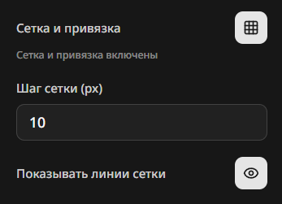 |
| Icon Scale (Масштаб иконок) | Глобальный множитель размера иконок |
| Icon Source (Источник иконок) | "Local" (встроенные иконки) или "CDN" (иконки с сервера игры) |
| Timer Direction (Направление таймера) | "Elapsed" (прямой отсчёт) или "Remaining" (обратный отсчёт до лимита времени сезона) |
| Stat Format (Формат характеристик) | "Round" (целые числа) или "Decimal" (два знака после запятой) |
| Spectator Mode (Режим зрителя) | Автоопределение или ручное переключение |
| Undo/Redo Steps (Шаги отмены/повтора) | Количество шагов истории (5-20) |
| Layout Sync (Синхронизация макета) | Выключено, Загрузка на сервер (Upload), Скачивание с сервера (Download) |
| Background Image (Фоновое изображение) | URL эталонного изображения, отображаемого за элементами оверлея |
| Sidebar Auto-Hide (Автоскрытие панели) | Автоматическое скрытие боковой панели после периода бездействия |
| Clipping Warnings (Предупреждения об обрезке) | Показывать предупреждение, когда содержимое элемента выходит за его границы |
| Element Outlines (Контуры элементов) | Отображение границ вокруг фонов иконок |
| Hide Element Titles (Скрыть заголовки) | Глобально скрыть заголовки элементов оверлея |
| OBS Hide Labels (Скрыть метки в OBS) | Скрыть текстовые метки характеристик в режиме OBS |
| Global Blur on Match End (Глобальное размытие) | Применять размытие/обесцвечивание/затемнение ко всем элементам при завершении матча |
| Per-Player End Blur (Размытие по игрокам) | Включить/выключить размытие при завершении для каждого слота игрока |
| Session Games Limit (Лимит игр сессии) | Максимальное количество игр в истории сессии (по умолчанию: 10) |

### Расширенные настройки

Включите "Advanced Settings" (Расширенные настройки) на вкладке настроек для доступа к:

- **Fake Data / Spoof Mode** (Фейковые данные / режим спуфинга): Симуляция данных матча без живой игры для тестирования макетов
- **Smart Interactions** (Умные взаимодействия): Анимированные уведомления об изменениях (экспериментально)
- **Layout Slots** (Слоты макетов): Сохранение нескольких пресетов макетов, переключение между ними
- **Layout Export/Import** (Экспорт/Импорт макетов): Копирование полного макета как закодированной строки, обмен с другими
- **Elements Export** (Экспорт элементов): Копирование выбранных элементов как строки, импорт в другой макет

---

## 4. Справочник компонентов

Полный справочник, документирующий все 80+ типов элементов оверлея, их свойства, источники данных, опции контекстного меню и правила видимости, находится в отдельном файле:

**[COMPONENT_REFERENCE_RU.md](COMPONENT_REFERENCE_RU.md)**

---

## 5. Настройка среды разработки

### Требования

- **Node.js** 18 или новее
- **npm** (поставляется с Node.js)
- **Git**
- **Google Chrome** (для расширения)
- **OBS Studio** (опционально, для тестирования оверлея как Browser Source)

### Клонирование репозитория

```
git clone https://github.com/OxCone1/Megabonk-Overlay.git
cd Megabonk-Overlay
```

### Relay-сервер (разработка)

```
cd relay-server
npm install
npm run dev
```

Запускает relay-сервер на порту 17502 с `nodemon` для автоматического перезапуска при изменении файлов.

Сервер будет:
- Слушать WebSocket-подключения на `ws://127.0.0.1:17502/ws`
- Обслуживать HTTP REST API на `http://127.0.0.1:17502/`
- Хранить настройки в `%LOCALAPPDATA%/MegaBonkRelay/relay-settings.json`
- Записывать логи в `relay-server/relay-server.log`

### Оверлей (разработка)

```
cd obs-megabonk-overlay
npm install
npm run dev
```

Запускает Vite dev-сервер (обычно на `http://localhost:5173/overlay/`). Оверлей подключается к relay-серверу по `ws://127.0.0.1:17502/ws`.

### Расширение Chrome (разработка)

1. Перейдите по адресу `chrome://extensions/` в Chrome
2. Включите "Режим разработчика"
3. Нажмите "Загрузить распакованное расширение" и выберите папку `extension/`
4. Перейдите на `https://ladder.megabonk.su/`

Расширение подключится к `ws://localhost:17502/ws` и начнёт ретрансляцию перехваченных данных.

### Сборка для продакшена

Скрипт `relay-server/build.ps1` (PowerShell) организует полный процесс сборки:

```powershell
cd relay-server
.\build.ps1
```

Этот скрипт:
1. Установит зависимости relay-сервера
2. Соберёт relay-сервер в автономный `.exe` с помощью `pkg` (Node.js 18, Windows x64, GZip-сжатие)
3. Скопирует скрипты установки/удаления в `dist/`
4. Соберёт фронтенд оверлея (`npm run build` в `obs-megabonk-overlay/`)
5. Упакует приложение Electron Tray с `electron-builder` (NSIS-инсталлятор для Windows)

Результат: `relay-server/dist/MegaBonkOverlay.exe` (NSIS-инсталлятор)

### Приложение Tray (разработка)

```
cd relay-server/tray
npm install
npm start
```

Запускает приложение Electron Tray в режиме разработки. Оно автоматически попытается найти и запустить исполняемый файл relay-сервера.

### Структура проекта

```
Megabonk-OBS/
  extension/                  Расширение Chrome (Manifest V3)
    manifest.json             Конфигурация расширения
    background.js             Service Worker -- WebSocket-ретранслятор на сервер
    content.js                Content Script -- мост между страницей и service worker
    inject.js                 Page Script (MAIN world) -- перехват WebSocket/Fetch
  relay-server/               Relay-сервер (Node.js)
    relay-server.js           Основной сервер: HTTP API + WebSocket-ретрансляция
    package.json              Зависимости (express, ws, nodemon, pkg)
    build.ps1                 Полный скрипт сборки
    install.ps1               Скрипт запуска инсталлятора
    uninstall.ps1             Полный деинсталлятор
    start-hidden.vbs          VBScript для запуска сервера без окна консоли
    lib/
      logger.js               Файловое логирование
      roomCache.js            LRU-кэш комнат (максимум 10)
      sessionTracking.js      Персистентное отслеживание рейтинга сессии
      settings.js             Персистентное хранение настроек пользователя
    tray/                     Приложение Electron Tray
      main.js                 Tray-приложение: жизненный цикл сервера, окно оверлея, горячие клавиши, автообновление
      package.json            Зависимости Electron + конфигурация electron-builder
  obs-megabonk-overlay/       OBS-оверлей (React SPA)
    vite.config.js            Конфигурация Vite (base: /overlay/)
    package.json              Фронтенд-зависимости
    src/
      App.jsx                 Корневой компонент
      main.jsx                Точка входа
      index.css               Tailwind CSS + тема + пользовательские шрифты
      stores/
        overlayStore.js       Zustand-хранилище -- всё UI-состояние оверлея, элементы, данные игроков
        gameDataStore.js      Zustand-хранилище -- данные игровых сущностей (герои, оружие, книги, предметы)
        smartInteractionsStore.js  Отслеживание событий умных взаимодействий
      components/
        elements/             80+ компонентов элементов оверлея (см. Справочник компонентов)
        overlay/              Инфраструктура холста (перетаскивание, изменение размера, сетка, выделение, рендеринг)
        sidebar/              Интерфейс боковой панели (палитра элементов, панель настроек)
        ui/                   Библиотека компонентов shadcn/ui
      hooks/
        useRelayServer.jsx    Ре-экспорт шим
        useRelayServerWorker.jsx  Основной хук: мост Web Worker, назначение слотов игроков, обнаружение зрителя
        useRelaySettings.jsx  Двунаправленная синхронизация настроек с relay-сервером
      workers/
        networkWorker.js      Выделенный Web Worker для WebSocket + HTTP коммуникации
      lib/
        i18n.js               Интернационализация (300+ ключей на язык, EN/RU)
        layoutShare.js        Сериализация/сжатие макетов (lz-string, компактный формат v2)
        stageTracking.js      Отслеживание прогресса стадий с данными о таймингах
        publicAsset.js        Разрешение путей к ассетам с учётом BASE_URL Vite
        utils.js              cn() объединитель классов, throttle, debounce утилиты
    public/
      Game Icons/             Локальные игровые иконки (Heroes/, Weapons/, Tomes/, Items/, Interface/)
    image_map.json            Оффлайн-маппинг путей иконок
    level_timings.json        Данные о таймингах событий по уровням
  docs/                       Документация
  scripts/                    Утилитарные скрипты разработки
```

---

## 6. Архитектура системы

### Диаграмма архитектуры

```
+-------------------------------------------------------------------+
|                       БРАУЗЕР ПОЛЬЗОВАТЕЛЯ                         |
|                                                                    |
|  +----------------------+     +------------------------------+     |
|  | ladder.megabonk.su   |     | Расширение Chrome            |     |
|  | (Сайт игры)          |     | MegaBonk WS Bridge           |     |
|  |                      |     |                              |     |
|  |  WebSocket-трафик    |---->| inject.js [MAIN world]       |     |
|  |  (события синхр.)    |     |   Monkey-patch WebSocket     |     |
|  |                      |     |   и Fetch API                |     |
|  |  HTTP API-ответы     |---->|                              |     |
|  |  (/api/heroes и др.) |     | content.js [Content Script]  |     |
|  +----------------------+     |   Мост: страница <-> расш.  |     |
|                               |                              |     |
|                               | background.js [Service Worker]|    |
|                               |   Постоянное WS-соединение  |     |
|                               |   с Relay-сервером           |     |
|                               +-------------|----------------+     |
+-------------------------------|-------------|--------------------- +
                                |             |
                   WebSocket    |             | WebSocket
                   (порт 17502) |             | (отправка перехваченных
                                |             |  API_RESPONSE,
                                |             |  WS_EVENT сообщений)
                                v             v
+-------------------------------------------------------------------+
|                       RELAY-СЕРВЕР                                 |
|                    (Node.js / Express / ws)                        |
|                       Порт 17502                                   |
|                                                                    |
|  +---------------------------+  +------------------------------+   |
|  | Игровой контекст в памяти |  | HTTP REST API                |   |
|  |                           |  |   /health                    |   |
|  | - Карта героев            |  |   /api/context               |   |
|  | - Карта оружия            |  |   /api/entities              |   |
|  | - Карта книг              |  |   /api/room, /api/room/:id   |   |
|  | - Карта предметов         |  |   /api/season, /api/seasons  |   |
|  | - Активный сезон + баны   |  |   /api/profile               |   |
|  | - Профиль                 |  |   /api/friends               |   |
|  | - Карта игроков           |  |   /api/translations          |   |
|  | - Метаданные комнаты      |  |   /api/settings (GET/POST)   |   |
|  | - Очередь                 |  |   /api/session               |   |
|  | - Друзья                  |  |   /overlay/* (стат. файлы)   |   |
|  | - Переводы               |  +------------------------------+   |
|  +---------------------------+                                     |
|                                                                    |
|  +---------------------------+  +------------------------------+   |
|  | WebSocket-сервер          |  | Кэш комнат (LRU, макс. 10)  |   |
|  |   /ws                     |  |   Последние 10 состояний     |   |
|  |   Учёт клиентов           |  |   Кэш банов комнат          |   |
|  |   Трансляция SPA/EXT      |  +------------------------------+   |
|  +---------------------------+                                     |
|                                                                    |
|  +---------------------------+  +------------------------------+   |
|  | Отслеживание сессии       |  | Хранилище настроек           |   |
|  |   Дельты рейтинга         |  |   Макеты пользователей       |   |
|  |   История побед/поражений |  |   Запись на диск              |   |
|  |   Запись на диск           |  +------------------------------+   |
|  +---------------------------+                                     |
+------------------------------|------------------------------------+
                                |
                                | WebSocket + HTTP
                                |
            +-------------------|-------------------+
            |                   v                   |
            |  +--------------------------------+   |
            |  | networkWorker.js (Web Worker)   |   |
            |  |   WebSocket-клиент              |   |
            |  |   HTTP fetch (сущности, комната,|   |
            |  |     профиль, сезон, сессия)     |   |
            |  |   Heartbeat (30 сек)            |   |
            |  |   Автопереподключение (exp.      |   |
            |  |     backoff)                    |   |
            |  |   Трансформация данных           |   |
            |  +-------------|------------------+   |
            |                | postMessage           |
            |                v                       |
            |  +--------------------------------+   |
            |  | useRelayServerWorker.jsx (Хук)  |   |
            |  |   Назначение слотов игроков     |   |
            |  |   Обнаружение зрителя           |   |
            |  |   Нормализация банов            |   |
            |  |   Грейс-период смены комнаты    |   |
            |  |   Обработка конца матча          |   |
            |  |   Троттлинг обновлений (drag)    |   |
            |  +-------------|------------------+   |
            |                | Обновление Zustand    |
            |                v                       |
            |  +--------------------------------+   |
            |  | overlayStore.js (Состояние)     |   |
            |  | gameDataStore.js (Сущности)     |   |
            |  |                                 |   |
            |  | React-компоненты рендерятся     |   |
            |  | из состояния хранилища          |   |
            |  +--------------------------------+   |
            |                                       |
            |  OBS-оверлей / Окно оверлея поверх игры|
            +---------------------------------------+

+-------------------------------------------------------------------+
|                  ПРИЛОЖЕНИЕ В ТРЕЕ                                  |
|                    (Electron-процесс)                              |
|                                                                    |
|  - Управление жизненным циклом Relay-сервера (старт/стоп/ребут)    |
|  - Иконка в системном трее с контекстным меню                      |
|  - Прозрачное, всегда-поверх BrowserWindow для оверлея             |
|  - Глобальные горячие клавиши (Ctrl+Shift+O, Ctrl+Shift+I)        |
|  - Автообновление через GitHub Releases                            |
|  - Опрос состояния каждые 5 секунд                                 |
|  - Персистентная конфигурация (путь сервера, горячие клавиши,       |
|    настройки)                                                      |
+-------------------------------------------------------------------+
```

### Протоколы коммуникации и типы данных

| Путь | Протокол | Тип данных |
|------|----------|------------|
| Сайт игры --> Расширение Chrome | Перехват на странице (monkey-patch WebSocket + Fetch) | Сырые WebSocket-фреймы (JSON), HTTP API-ответы (JSON) |
| Расширение Chrome (inject.js --> content.js) | `window.postMessage` | Сериализованные объекты событий (тип `WS_BRIDGE`) |
| Расширение Chrome (content.js --> background.js) | `chrome.runtime.sendMessage` | Объекты событий с вложенными JSON-строками |
| Расширение Chrome (background.js --> Relay-сервер) | WebSocket (`ws://127.0.0.1:17502/ws`) | JSON-сообщения: `API_RESPONSE` (герои, оружие, книги, предметы, сезон, профиль, комната, друзья, переводы), `WS_EVENT` (синхронизация игры, канал игрока, канал матчмейкинга) |
| Relay-сервер --> Оверлей (трансляция) | WebSocket (`ws://127.0.0.1:17502/ws`) | `context-update` (типизированное частичное состояние), `player-update` (дельта одного игрока), `room-changed`, `room-data-available`, `heartbeat-ack` |
| Оверлей --> Relay-сервер (запросы) | HTTP GET/POST (`http://127.0.0.1:17502/api/*`) | Данные сущностей, состояние комнаты, информация о сезоне, настройки пользователя, статистика сессии |
| Worker оверлея --> Основной поток | `postMessage` / `onmessage` | Трансформированные игровые данные: сущности, игроки, метаданные комнаты, баны, состояние очереди, статистика сессии |
| Relay-сервер --> Tray-приложение | HTTP-опрос (`/health`) | Статус сервера, статус сессии, статус обслуживания оверлея |
| Relay-сервер --> Диск | Файловый ввод-вывод | JSON настроек (`relay-settings.json`), JSON сессии (`relay-session.json`), логи (`relay-server.log`) |

### Категории потоков данных

| Категория | Содержимое | Источник | Назначение |
|-----------|-----------|----------|------------|
| Данные сущностей | Герои, оружие, книги, предметы (ID, имя, изображение, редкость) | Game API `/api/heroes`, `/api/weapons`, `/api/tomes`, `/api/items` | Relay `gameContext` Maps --> Оверлей `gameDataStore` |
| Данные сезона | Имя активного сезона, лимит времени, лимит пауз, даты, карты, правила банов | Game API `/api/seasons/active` | Relay `gameContext.activeSeason` + `bans` --> Оверлей `seasonInfo` |
| Данные профиля | ID пользователя, ник, аватар, страна, рейтинг | Game API `/api/profile` | Relay `gameContext.profile` --> Оверлей `currentUser_id` |
| Данные комнаты | ID комнаты, номер лобби, тип очереди, статус, фаза, ID игроков, профили, статус игры | Game API `/api/room/*` + WebSocket-события `room_update` | Relay `gameContext.roomMeta` --> Оверлей `roomMeta` |
| Данные раунда игрока | Персонаж (герой, уровень, характеристики), экипировка (оружие, книги, предметы с уровнями/количеством), боевая статистика (убийства, золото, урон, святилища, игровая статистика, источники урона), карта (тир, стадия) | WebSocket-события `run_data_updated` | Relay `gameContext.players` Map --> Оверлей `player1State` / `player2State` |
| Данные банов | Системно заблокированные сущности, забаненные игроком сущности (герои, оружие, книги, предметы по редкости) | API данные комнаты + WebSocket-события `match_start` / `bans_updated` / `bans_confirmed` | Relay `gameContext.roomBans` --> Оверлей `roomBans` |
| Данные очереди | Статус очереди, тип, рейтинг, размер, прошедшее время, ID предложения, состояние принятия | WebSocket-события `finder:player:*` | Relay `gameContext.queueState` --> Оверлей `queueState` |
| Данные переводов | Строки UI игры на нескольких языках | Game API `/api/i18n/translations` | Relay `gameContext.translations` --> Кэш i18n оверлея |
| Данные сессии | Начальный рейтинг/ранг, текущий рейтинг/ранг, история игр с дельтами | Отслеживание сессии relay-сервера (вычисляется из событий комнаты/матча) | Relay `sessionTracking` --> Оверлей `sessionStats` |
| Данные настроек | Payload макета (элементы, группы, разрешение, настройки иконок), закодированный в base64 | Оверлей --> Relay-сервер HTTP POST `/api/settings` | Хранилище настроек Relay --> Диск |

---

## 7. Известные баги

- **Назначение слотов игроков в режиме зрителя**: При быстром переключении между комнатами в режиме зрителя может возникнуть кратковременный момент, когда данные игроков отображаются в неправильном слоте. Грейс-период смены комнаты в 350 мс смягчает эту проблему, но не устраняет полностью.
- **Гонки условий при обработке банов**: Во время фазы банов, если события `bans_updated` и `match_start` приходят в быстрой последовательности, слоты банов могут начать показывать некорректные назначения. Частота этой проблемы незначительна 1 из 10 матчей, если данный баг возникает, рекомендуется перезапустить relay-сервер, а после перезагрузить страницу игры.
- **Персистентность фонового изображения**: URL фонового изображения не сохраняется при экспорте/импорте расположений. Его необходимо устанавливать повторно вручную после импорта расположения.
- **Переподключение расширения Chrome**: Если relay-сервер перезапущен, service worker расширения Chrome может потребовать до 30 секунд (максимальный backoff) для переподключения. В это время игровые данные ставятся в очередь (до 1000 сообщений) и доставляются после восстановления соединения.
- **Одиночный экземпляр tray-приложения**: В редких случаях блокировка одиночного экземпляра может не освободиться корректно после краша, что требует ручного завершения предыдущего процесса перед запуском нового.
- **Загрузка CDN-иконок**: При использовании источника иконок CDN, иконки могут не загружаться, если игровой сервер недоступен или формат URL изменился. Локальные иконки (встроенные) рекомендуются для надёжности.
- **Пограничные случаи отслеживания стадий**: Система отслеживания стадий основывается на изменениях счётчика убийств и данных таймингов из `level_timings.json`. Если в игре появятся новые механики стадий или изменятся тайминги, отображение может стать неточным до обновления данных о таймингах.
- **Режим спуфинга**: Включение режима спуфинга для тестирования макетов может привести к отображению некорректных данных, если не выключить его после тестирования, так как он будет продолжать генерировать фейковые данные, которые могут не соответствовать реальным матчам. Рекомендуется использовать режим спуфинга только для настройки макетов и отключать его для обычного использования. После отключения режима спуфинга, рекомендуется перезапустить relay-сервер для очистки любых оставшихся фейковых данных в состоянии.
- **Режим прозрачности/редактирования оверлея в внутриигровом режиме**: Включение режима прозрачности для кликов (для взаимодействия с игрой) (Ctrl+Shift+I) убирает Pause/Play кнопку в нижнем правом углу оверлея, что может затруднить переключение между режимами редактирования. Рекомендуется использовать горячую клавишу Ctrl+Shift+O для перезапуска оверлея (вкл/выкл). Как только оверлей перезапустится, данная кнопка снова появится, и вы сможете переключаться между режимами редактирования и прозрачности.
- **Умные взаимодействия**: Изначально задумывались как активная функция, система умных взаимодействий находится в экспериментальном состоянии и может выдавать неточные или пропущенные уведомления из-за сложности сравнения состояний игры. Она отключена по умолчанию и должна включаться с осторожностью. Если кто-то заинтересован в улучшении этой системы, пожалуйста, свяжитесь или отправьте pull request! Я предоставил специальный скрипт, который захватывает все события, происходящие в игре, и записывает их в файл, который можно использовать для анализа и уточнения логики обнаружения событий без необходимости играть в живые игры. Перейдите в `scripts/ws-diff-logger.js` и запустите его с помощью `node ws-diff-logger.js --player 1` (или `--player 2`), чтобы начать запись событий для указанного слота игрока. Вывод будет сохранён в `/scripts/logs/ws-diff-logs.log` для анализа. Для захвата событий требуется запустить relay-сервер и присоединиться к матчу.

---

## 8. Заметки автора

- Как уже ранее говорил, изначально я создавал этот оверлей как инструмент для стримеров, чтобы они могли отображать информацию о своих матчах в более удобном и визуально привлекательном формате. Однако, по мере разработки, я понял, что он может быть полезен не только для стримеров, но и для обычных игроков. 
- Когда идея про оверлей уже созрела, я начал думать о том, как иммено сделать его. Один вариант что я рассматривал, это убрать необходимость в постоянно открытой вкладке браузера, создав собственный сервак (живущий локально на компьютере каждого пользователя) который бы сам обменивался данными с сервером MegaLadder'a через WS и API, но я решил, что это будет не очень этично по отношению к разработчикам MegaLadder, а так же предположил что в какой-то степени может нарушать правила сайта + это бы значительно усложнило взаимодействие пользователя с оверлеем, так как ему бы пришлось каждый раз логиниться на сайте и вручную вытаскивать токен авторизации стима (который к тому же имеет не очень-то и большую продолжительность жизни(около 1-3 дней)), поэтому идея с расширением Хрома, которое по сути просто слушает данные, которые уже приходят на сайт и ретранслирует их в локальный сервер, показалась мне более простой, надёжной и этичной.
- Далее обдумывалась сама реализация оверлея, я хотел сделать его максимально настраиваемым, чтобы пользователи могли создавать свои собственные макеты и сохранять их, а также делиться ими с другими. Изначально я планировал реализовать систему плагинов, которая позволила бы пользователям создавать свои собственные типы элементов оверлея, но ограничился базовой функциональностью для экспорта/импорта отдельных элементов макета, так как это уже предоставляло достаточно гибкости для создания более уникальных оверлеев. Да, формат в котором сохраняются макеты получился довольно длинным (особенно если в макете много элементов), здесь больше бы подошёл отдельный сервис для хранения/обмена макетами между пользователями, но я решил, что это уже будет избыточно для данного проекта, так как даже с таким форматом обмен макетами между пользователями всё равно остаётся достаточно простым.

---

## 9. Планы развития

- **Поддержка дополнительных языков** помимо английского и русского
- **Расширенные умные взаимодействия** с большим количеством типов событий и настраиваемыми стилями уведомлений
- **Запись/воспроизведение** данных матча для пост-игрового анализа
- **Несколько профилей оверлея** с быстрым переключением
- **Историческое отслеживание статистики** с возможностью построения графиков по нескольким сессиям
<!-- - **Оверлей производительности** с отображением тайминга кадров и частоты WebSocket-сообщений -->
<!-- - **Система плагинов** для пользовательских типов элементов от сообщества -->
<!-- - **Мобильный компаньон** для мониторинга состояния оверлея с телефона -->
<!-- - **Интеграция с вебхуками** для публикации результатов матчей в Discord или на другие платформы -->
<!-- - **Маркетплейс макетов** для обмена конфигурациями оверлеев между пользователями -->
<!-- - **Темы оверлея** с предварительно настроенными цветовыми схемами и выбором шрифтов -->
<!-- - **Поддержка нескольких мониторов** для размещения элементов оверлея на нескольких дисплеях -->
<!-- - **Компактный/минимальный режим** с упрощённым интерфейсом для обычных пользователей -->

---

## 10. Арт и благодарности

- **Иконки**: Все иконки оружия, томов и предметов были взяты из [пресс-кита](https://megabonk.itch.io/megabonk-presskit-release), предоставленного [Ved](https://www.youtube.com/@Vedinad). Иконки интерфейса и героев были вручную извлечены из игровых файлов и включены локально в оверлей для надёжности. Файл `image_map.json` содержит сопоставление ID сущностей с локальными путями иконок.
- **Шрифты**: Пиксельный шрифт "Alagard" используется для всего текста в оверлее. Он включён в проект в папке `obs-megabonk-overlay/src/assets/fonts/`. Для всех неанглийских символов (например, русских) предусмотрён запасной шрифт Noto Sans.
- **Иконка приложения**: Особая благодарность [TysoBro](https://www.instagram.com/tysobro_) за разрешение использовать одну из их замечательных работ в качестве иконки приложения! Иконка была создана TysoBro и используется с разрешения автора. Больше работ автора можно посмотреть в их [Instagram](https://www.instagram.com/tysobro_/). Ссылка на оригинальную иллюстрацию, использованную для иконки: [TysoBro Art](https://www.newgrounds.com/art/view/tysobro/megabonk-fox-2).

| Оригинальное арт от TysoBro | Иконка приложения (редктированно OxCone) |
| :---: | :---: |
|  |  |

- **Сообществу MegaLadder**: Огромная благодарность всем людям, которые создавали и поддерживают сайт Megaladder и его API — без них этот проект бы не состоялся. Отдельная благодарность [Владу (SilverName)](https://www.twitch.tv/silvername) за инициативу по созданию отличной соревновательной платформы для сообщества MegaBonk! Благодаря Megaladder соревновальная сцена получила развитие, вдохновение и долгую жизнь. Спасибо всем тем за кем я наблюдал в режиме зрителя - спасибо что не фидили в первые минуты! Я искренне благодарен за проделанную работу и надеюсь, что этот оверлей сможет внести небольшой вклад в улучшение опыта игроков и зрителей. ГААААЗ! (ну или же подгазик)
- **Контрибьюторы**: В настоящее время проект разрабатывается исключительно мной. Тем не менее, вклад от сообщества всегда приветствуется! Если у вас есть идеи, исправления или пожелания по новым функциям, отправляйте pull request или открывайте проблемы (issues) в репозитории на GitHub.

---

## 11. Дисклеймер

- **Неофициальный проект**: Этот оверлей является неофициальным фанатским проектом и не связан с разработчиками MegaBonk или Megaladder. Он предназначен только для личного и общественного использования.
- **Используйте на свой страх и риск**: Хотя я приложил все усилия для обеспечения стабильности и безопасности этого оверлея, он предоставляется "как есть" без каких-либо гарантий. Используйте его на свой страх и риск и будьте внимательны при загрузке и запуске исполняемых файлов из интернета.
- **Конфиденциальность**: Оверлей и relay-сервер работают локально на вашей машине и не передают персональные данные внешним серверам. Расширение Chrome перехватывает только данные с сайта Megaladder и пересылает их в локальный сервер. Проект не сохраняет и не передаёт данные третьим сторонам.
- **Поддержка**: Поскольку это бесплатный проект с открытым исходным кодом, разработанный в моё свободное время, я могу не всегда иметь возможность предоставлять мгновенную поддержку для багов или запросов функционала. Я постараюсь исправлять ошибки и рассматривать новые функции по мере возможностей. Пожалуйста, проявляйте терпение и вносите свой вклад, если у вас есть такая возможность!
- **Юридическая информация**: Все игровые данные получаются через официальный Megaladder API и WebSocket-события. Оверлей не изменяет игровой клиент и не взаимодействует с ним напрямую, он лишь отображает данные, публично доступные через Megaladder. Пользователям следует учитывать условия использования Megaladder и убедиться, что использование оверлея не нарушает их правила.
- **Использование ИИ**: Некоторые части кода и документации были разработаны с помощью инструментов искусственного интеллекта. Я проверил и протестировал весь код, написанный с помощью ИИ, однако могут оставаться крайние случаи или ошибки, о которых мне неизвестно. Если вы обнаружите какие-либо проблемы, пожалуйста, сообщите об этом, и я их расследую и исправлю.

---

*Последнее обновление: февраль 2026*
*Репозиторий: https://github.com/OxCone1/Megabonk-Overlay*
